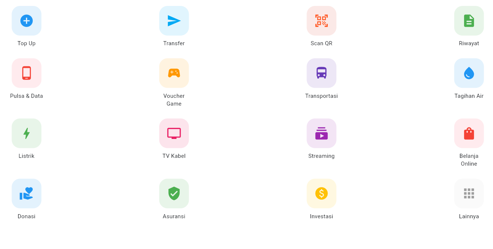
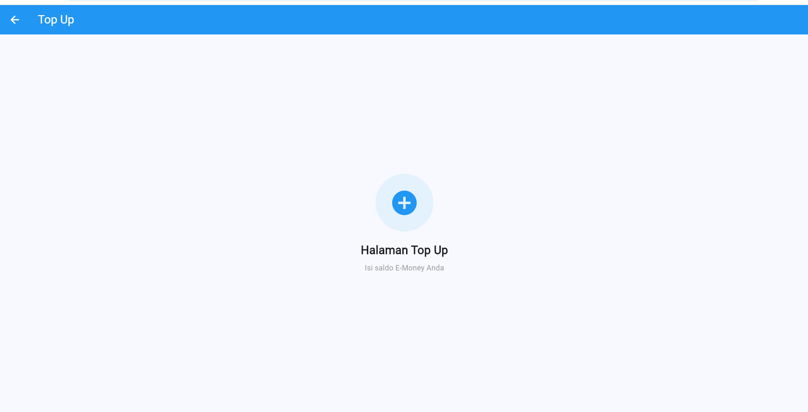

# E-Money - Tugas Pertemuan 3

Implementasi Menu E-Money & Navigation menggunakan Flutter.

## Identitas

| | |
|---|---|
| **Nama** | Farrel Gavin Azarya Fadillillah |
| **NIM** | 152024016 |
| **Kelas** | BB |
| **Mata Kuliah** | Pemrograman Mobile |

## Deskripsi

Aplikasi E-Money sederhana yang menampilkan 16 menu layanan dalam 4 baris. Setiap menu dapat diklik dan membuka halaman yang berbeda menggunakan `Navigator.push()`. Setiap halaman tujuan memiliki `AppBar` dan nama halaman.

## Daftar Menu

| Baris | Menu | Halaman Tujuan |
|---|---|---|
| 1 | Top Up, Transfer, Scan QR, Riwayat | `TopUpPage`, `TransferPage`, `ScanQrPage`, `RiwayatPage` |
| 2 | Pulsa & Data, Voucher Game, Transportasi, Tagihan Air | `PulsaDataPage`, `VoucherGamePage`, `TransportasiPage`, `TagihanAirPage` |
| 3 | Listrik, TV Kabel, Streaming, Belanja Online | `ListrikPage`, `TvKabelPage`, `StreamingPage`, `BelanjaOnlinePage` |
| 4 | Donasi, Asuransi, Investasi, Lainnya | `DonasiPage`, `AsuransiPage`, `InvestasiPage`, `LainnyaPage` |

## Ketentuan yang Dipenuhi

- `MenuPage` diselesaikan hingga baris terakhir.
- Hanya memakai widget dasar: `Column`, `Row`, `Container`, `Icon`, `Text`, dan `SizedBox` (ditambah `GestureDetector` agar menu dapat diklik).
- Tidak menggunakan reusable widget/class `MenuItem`.
- Setiap menu membuka halaman yang berbeda dengan `Navigator.push()`.
- Setiap halaman tujuan memiliki `AppBar` dan nama halaman.
- Icon dan warna disesuaikan dengan fungsi masing-masing menu.

## Struktur Project

```
lib/
├── main.dart             # Titik masuk aplikasi
├── menu_page.dart        # Halaman menu utama (16 menu)
└── halaman_tujuan.dart   # 16 halaman tujuan
```

## Cara Menjalankan

```bash
git clone https://github.com/gavinn13/tugas3-pemrogramman-mobile.git
cd tugas3-pemrogramman-mobile
flutter pub get
flutter run
```

## Cara Kerja Navigasi

Menu dibungkus `GestureDetector`. Saat diklik, `Navigator.push()` menambahkan halaman tujuan ke atas tumpukan halaman (stack) dengan `MaterialPageRoute`. Tombol kembali pada `AppBar` menjalankan `Navigator.pop()` sehingga pengguna kembali ke `MenuPage`.

```dart
Navigator.push(
  context,
  MaterialPageRoute(builder: (context) => const TopUpPage()),
);
```

## Screenshot

## Screenshot

| MenuPage | Halaman Top Up |
|:---:|:---:|
|  |  |
